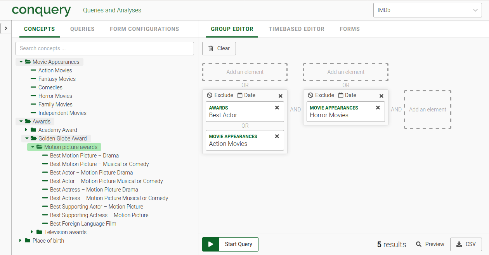
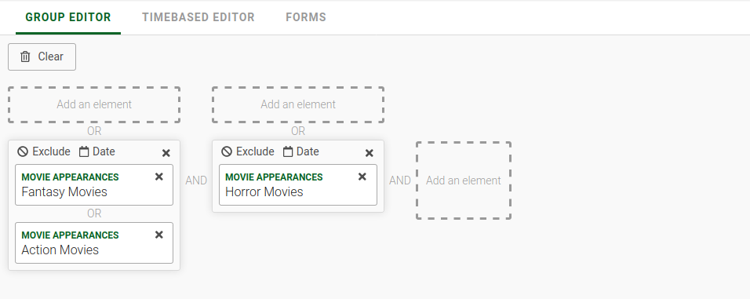
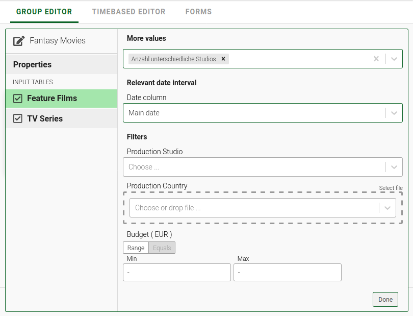
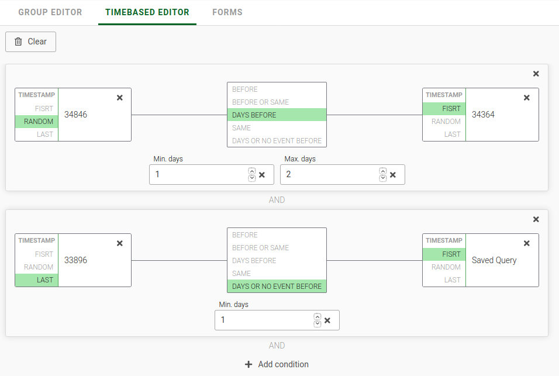
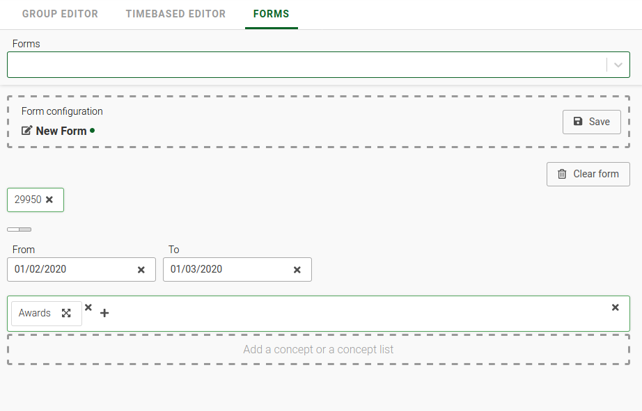

# conquery-frontend
## Usage:
**Disclaimer: the entire usage section is guesswork.**

The user of this software will mostly likely be [ingef](https://www.ingef.de/), a data science business that primarily targets public sector health insurenca companies in germany.
They already use it to provide self service data analysis for their customers. 

Most likely, the database that this App will eventually run against, is the one described in this paper: 
[Influence of thyroid hormone therapy on the fracture rate — A claims data cohort study](https://www.sciencedirect.com/science/article/abs/pii/S8756328216300564)


This section describes the different views of the app and their functionality.
The app consists of two columns:
- Left: consisting three tabs for Concepts, Queries andd Forms that display the basic entities that can be combined into queries.
- Right: Group-editor, Timebased-editor and Forms are three different ways to build queries out of concepts, queries and forms.



### Group Editor


This editor allows to build simple queries by combining nodes with AND and OR statements.
nodes can be "CONCEPTS" from the concept tab or pas "QUERIES" from the queries tab in the middle pane.

The state for the group editor according to this screenshot is given by
```javascript
{
  queryEditor: {
    query: [
      {
        elements: [
          {
            label: 'Fantasy Movies',
            ids: [
              'fantasy_movies'
            ],
            tables: [
              {
                connectorId: 'feature_films',
                id: 'feature_films',
                label: 'Feature Films',
                dateColumn: {
                  id: '385623',
                  options: [
                    {
                      label: 'Main date',
                      value: 'main_date'
                    },
                    {
                      label: 'Another date',
                      value: 'another_date'
                    }
                  ],
                  value: 'main_date'
                },
                selects: [
                  {
                    id: '12345678',
                    label: 'Anzahl unterschiedliche Studios',
                    description: 'Beispieldescription',
                    'default': true,
                    selected: true
                  },
                  {
                    id: '123456789',
                    label: 'Summe Budget',
                    description: 'Die Summe berechnet sich aus X und Y und Z und example.',
                    selected: false
                  }
                ],
                filters: [
                  {
                    id: 'studio',
                    label: 'Production Studio',
                    type: 'MULTI_SELECT',
                    description: 'The studio producing the movie',
                    options: [
                      {
                        value: 'universal',
                        label: 'Universal Studios'
                      },
                      {
                        value: 'paramount',
                        label: 'Paramount Pictures'
                      },
                      {
                        value: 'warner_bros',
                        label: 'Warner Bros.'
                      },
                      {
                        value: '20th_century_fox',
                        label: '20th Century Fox'
                      },
                      {
                        value: 'sony',
                        label: 'Sony/Columbia Pictures'
                      },
                      {
                        value: 'disney',
                        label: 'Walt Disney Studios'
                      }
                    ],
                    value: []
                  },
                  {
                    id: 'production_country',
                    label: 'Production Country',
                    type: 'BIG_MULTI_SELECT',
                    allowDropFile: true,
                    options: [
                      {
                        value: 'GER',
                        label: 'Germany'
                      },
                      {
                        value: 'USA',
                        label: 'United States (USA)'
                      }
                    ],
                    value: []
                  },
                  {
                    id: 'budget',
                    label: 'Budget',
                    type: 'MONEY_RANGE',
                    unit: 'EUR',
                    description: 'The movie\'s total budget',
                    min: 1,
                    value: null
                  }
                ],
                exclude: false
              },
              {
                connectorId: 'tv_series',
                id: 'tv_series',
                label: 'TV Series',
                dateColumn: {
                  id: '385623',
                  options: [
                    {
                      label: 'Main date',
                      value: 'main_date'
                    },
                    {
                      label: 'Another date',
                      value: 'another_date'
                    }
                  ],
                  value: 'main_date'
                },
                filters: [
                  {
                    id: 'network',
                    label: 'Network',
                    type: 'MULTI_SELECT',
                    description: 'The original broadcasting network',
                    options: [
                      {
                        value: 'amc',
                        label: 'AMC'
                      },
                      {
                        value: 'fox',
                        label: 'FOX'
                      },
                      {
                        value: 'cbs',
                        label: 'CBS'
                      },
                      {
                        value: 'hbo',
                        label: 'HBO'
                      },
                      {
                        value: 'netflix',
                        label: 'Netflix'
                      },
                      {
                        value: 'amazon',
                        label: 'Amazon Video'
                      }
                    ],
                    value: []
                  },
                  {
                    id: 'picture_format',
                    label: 'Picture Format',
                    type: 'SELECT',
                    description: 'The original picture format',
                    defaultValue: 'hdtv',
                    options: [
                      {
                        value: 'sdtv',
                        label: 'SDTV'
                      },
                      {
                        value: 'hdtv',
                        label: 'HDTV'
                      },
                      {
                        value: '4k',
                        label: '4K'
                      }
                    ],
                    value: 'hdtv'
                  },
                  {
                    id: 'production_country',
                    label: 'Production Country',
                    type: 'BIG_MULTI_SELECT',
                    value: []
                  },
                  {
                    id: 'series_count',
                    label: 'Number of series',
                    type: 'INTEGER_RANGE',
                    distinct: true,
                    unit: '#',
                    description: 'The total number of series',
                    pattern: '^(?!-)\\d*$',
                    min: 1,
                    value: null
                  }
                ],
                exclude: false,
                selects: null
              }
            ],
            selects: [
              {
                id: '12345678',
                label: 'Filme gespielt Gesamt',
                description: 'Beispieldescription',
                'default': true,
                selected: true
              },
              {
                id: '123456789',
                label: 'Summe Gage',
                description: 'Die Summe berechnet sich aus X und Y und Z und example.',
                selected: false
              },
              {
                id: '123456789a',
                label: 'Hatte Spaß im Dreh',
                description: 'Der Spaß ist manchmal gegeben und manchmal nicht.',
                selected: false
              }
            ],
            tree: 'movie_appearances',
            matchingEntries: 9374
          },
          {
            label: 'Action Movies',
            ids: [
              'action_movies'
            ],
            tables: [
              {
                connectorId: 'feature_films',
                id: 'feature_films',
                label: 'Feature Films',
                dateColumn: {
                  id: '385623',
                  options: [
                    {
                      label: 'Main date',
                      value: 'main_date'
                    },
                    {
                      label: 'Another date',
                      value: 'another_date'
                    }
                  ],
                  value: 'main_date'
                },
                selects: [
                  {
                    id: '12345678',
                    label: 'Anzahl unterschiedliche Studios',
                    description: 'Beispieldescription',
                    'default': true,
                    selected: true
                  },
                  {
                    id: '123456789',
                    label: 'Summe Budget',
                    description: 'Die Summe berechnet sich aus X und Y und Z und example.',
                    selected: false
                  }
                ],
                filters: [
                  {
                    id: 'studio',
                    label: 'Production Studio',
                    type: 'MULTI_SELECT',
                    description: 'The studio producing the movie',
                    options: [
                      {
                        value: 'universal',
                        label: 'Universal Studios'
                      },
                      {
                        value: 'paramount',
                        label: 'Paramount Pictures'
                      },
                      {
                        value: 'warner_bros',
                        label: 'Warner Bros.'
                      },
                      {
                        value: '20th_century_fox',
                        label: '20th Century Fox'
                      },
                      {
                        value: 'sony',
                        label: 'Sony/Columbia Pictures'
                      },
                      {
                        value: 'disney',
                        label: 'Walt Disney Studios'
                      }
                    ],
                    value: []
                  },
                  {
                    id: 'production_country',
                    label: 'Production Country',
                    type: 'BIG_MULTI_SELECT',
                    allowDropFile: true,
                    options: [
                      {
                        value: 'GER',
                        label: 'Germany'
                      },
                      {
                        value: 'USA',
                        label: 'United States (USA)'
                      }
                    ],
                    value: []
                  },
                  {
                    id: 'budget',
                    label: 'Budget',
                    type: 'MONEY_RANGE',
                    unit: 'EUR',
                    description: 'The movie\'s total budget',
                    min: 1,
                    value: null
                  }
                ],
                exclude: false
              },
              {
                connectorId: 'tv_series',
                id: 'tv_series',
                label: 'TV Series',
                dateColumn: {
                  id: '385623',
                  options: [
                    {
                      label: 'Main date',
                      value: 'main_date'
                    },
                    {
                      label: 'Another date',
                      value: 'another_date'
                    }
                  ],
                  value: 'main_date'
                },
                filters: [
                  {
                    id: 'network',
                    label: 'Network',
                    type: 'MULTI_SELECT',
                    description: 'The original broadcasting network',
                    options: [
                      {
                        value: 'amc',
                        label: 'AMC'
                      },
                      {
                        value: 'fox',
                        label: 'FOX'
                      },
                      {
                        value: 'cbs',
                        label: 'CBS'
                      },
                      {
                        value: 'hbo',
                        label: 'HBO'
                      },
                      {
                        value: 'netflix',
                        label: 'Netflix'
                      },
                      {
                        value: 'amazon',
                        label: 'Amazon Video'
                      }
                    ],
                    value: []
                  },
                  {
                    id: 'picture_format',
                    label: 'Picture Format',
                    type: 'SELECT',
                    description: 'The original picture format',
                    defaultValue: 'hdtv',
                    options: [
                      {
                        value: 'sdtv',
                        label: 'SDTV'
                      },
                      {
                        value: 'hdtv',
                        label: 'HDTV'
                      },
                      {
                        value: '4k',
                        label: '4K'
                      }
                    ],
                    value: 'hdtv'
                  },
                  {
                    id: 'production_country',
                    label: 'Production Country',
                    type: 'BIG_MULTI_SELECT',
                    value: []
                  },
                  {
                    id: 'series_count',
                    label: 'Number of series',
                    type: 'INTEGER_RANGE',
                    distinct: true,
                    unit: '#',
                    description: 'The total number of series',
                    pattern: '^(?!-)\\d*$',
                    min: 1,
                    value: null
                  }
                ],
                exclude: false,
                selects: null
              }
            ],
            selects: [
              {
                id: '12345678',
                label: 'Filme gespielt Gesamt',
                description: 'Beispieldescription',
                'default': true,
                selected: true
              },
              {
                id: '123456789',
                label: 'Summe Gage',
                description: 'Die Summe berechnet sich aus X und Y und Z und example.',
                selected: false
              },
              {
                id: '123456789a',
                label: 'Hatte Spaß im Dreh',
                description: 'Der Spaß ist manchmal gegeben und manchmal nicht.',
                selected: false
              }
            ],
            tree: 'movie_appearances',
            additionalInfos: [
              {
                key: 'Action film',
                value: 'is a [genre](https://en.wikipedia.org/wiki/Genre) in which the protagonist or protagonists end up in a series of challenges that typically include violence, extended fighting, physical feats, and frantic chases.\n\n ### [History](https://en.wikipedia.org/wiki/Action_film#History)\n * [Early action films](https://en.wikipedia.org/wiki/Action_film#Early_action_films)\n * [1970s](https://en.wikipedia.org/wiki/Action_film#1970s)\n * [1980s](https://en.wikipedia.org/wiki/Action_film#1980s)\n * [1990s](https://en.wikipedia.org/wiki/Action_film#1990s)\n * [2000s](https://en.wikipedia.org/wiki/Action_film#2000s)\n * [2010s](https://en.wikipedia.org/wiki/Action_film#2010s)\n\n'
              }
            ],
            matchingEntries: 8234,
            dateRange: {
              min: '2009-12-07',
              max: '2018-03-20'
            }
          }
        ],
        dateRange: null
      },
      {
        elements: [
          {
            label: 'Horror Movies',
            ids: [
              'horror_movies'
            ],
            tables: [
              {
                connectorId: 'feature_films',
                id: 'feature_films',
                label: 'Feature Films',
                dateColumn: {
                  id: '385623',
                  options: [
                    {
                      label: 'Main date',
                      value: 'main_date'
                    },
                    {
                      label: 'Another date',
                      value: 'another_date'
                    }
                  ],
                  value: 'main_date'
                },
                selects: [
                  {
                    id: '12345678',
                    label: 'Anzahl unterschiedliche Studios',
                    description: 'Beispieldescription',
                    'default': true,
                    selected: true
                  },
                  {
                    id: '123456789',
                    label: 'Summe Budget',
                    description: 'Die Summe berechnet sich aus X und Y und Z und example.',
                    selected: false
                  }
                ],
                filters: [
                  {
                    id: 'studio',
                    label: 'Production Studio',
                    type: 'MULTI_SELECT',
                    description: 'The studio producing the movie',
                    options: [
                      {
                        value: 'universal',
                        label: 'Universal Studios'
                      },
                      {
                        value: 'paramount',
                        label: 'Paramount Pictures'
                      },
                      {
                        value: 'warner_bros',
                        label: 'Warner Bros.'
                      },
                      {
                        value: '20th_century_fox',
                        label: '20th Century Fox'
                      },
                      {
                        value: 'sony',
                        label: 'Sony/Columbia Pictures'
                      },
                      {
                        value: 'disney',
                        label: 'Walt Disney Studios'
                      }
                    ],
                    value: []
                  },
                  {
                    id: 'production_country',
                    label: 'Production Country',
                    type: 'BIG_MULTI_SELECT',
                    allowDropFile: true,
                    options: [
                      {
                        value: 'GER',
                        label: 'Germany'
                      },
                      {
                        value: 'USA',
                        label: 'United States (USA)'
                      }
                    ],
                    value: []
                  },
                  {
                    id: 'budget',
                    label: 'Budget',
                    type: 'MONEY_RANGE',
                    unit: 'EUR',
                    description: 'The movie\'s total budget',
                    min: 1,
                    value: null
                  }
                ],
                exclude: false
              },
              {
                connectorId: 'tv_series',
                id: 'tv_series',
                label: 'TV Series',
                dateColumn: {
                  id: '385623',
                  options: [
                    {
                      label: 'Main date',
                      value: 'main_date'
                    },
                    {
                      label: 'Another date',
                      value: 'another_date'
                    }
                  ],
                  value: 'main_date'
                },
                filters: [
                  {
                    id: 'network',
                    label: 'Network',
                    type: 'MULTI_SELECT',
                    description: 'The original broadcasting network',
                    options: [
                      {
                        value: 'amc',
                        label: 'AMC'
                      },
                      {
                        value: 'fox',
                        label: 'FOX'
                      },
                      {
                        value: 'cbs',
                        label: 'CBS'
                      },
                      {
                        value: 'hbo',
                        label: 'HBO'
                      },
                      {
                        value: 'netflix',
                        label: 'Netflix'
                      },
                      {
                        value: 'amazon',
                        label: 'Amazon Video'
                      }
                    ],
                    value: []
                  },
                  {
                    id: 'picture_format',
                    label: 'Picture Format',
                    type: 'SELECT',
                    description: 'The original picture format',
                    defaultValue: 'hdtv',
                    options: [
                      {
                        value: 'sdtv',
                        label: 'SDTV'
                      },
                      {
                        value: 'hdtv',
                        label: 'HDTV'
                      },
                      {
                        value: '4k',
                        label: '4K'
                      }
                    ],
                    value: 'hdtv'
                  },
                  {
                    id: 'production_country',
                    label: 'Production Country',
                    type: 'BIG_MULTI_SELECT',
                    value: []
                  },
                  {
                    id: 'series_count',
                    label: 'Number of series',
                    type: 'INTEGER_RANGE',
                    distinct: true,
                    unit: '#',
                    description: 'The total number of series',
                    pattern: '^(?!-)\\d*$',
                    min: 1,
                    value: null
                  }
                ],
                exclude: false,
                selects: null
              }
            ],
            selects: [
              {
                id: '12345678',
                label: 'Filme gespielt Gesamt',
                description: 'Beispieldescription',
                'default': true,
                selected: true
              },
              {
                id: '123456789',
                label: 'Summe Gage',
                description: 'Die Summe berechnet sich aus X und Y und Z und example.',
                selected: false
              },
              {
                id: '123456789a',
                label: 'Hatte Spaß im Dreh',
                description: 'Der Spaß ist manchmal gegeben und manchmal nicht.',
                selected: false
              }
            ],
            tree: 'movie_appearances',
            matchingEntries: 24093
          }
        ],
        dateRange: null
      }
    ],
    queryRunner: {
      runningQuery: null,
      queryRunning: false,
      startQuery: {},
      stopQuery: {},
      queryResult: null
    }
  }
}
```
It seems however, that most of this is redundant and already present in the `conceptTree` 
section of the state.

Clicking on one of the nodes opens a view that lets the user set a range of filters and 
options for that node:


### Timebased Editor
The Timebased Editor lets the user compare the results of different queries. 



According to the conquery README, one use case of the app, is to identify similar subjects/individuals 
based on the assumption that they share similar events in a given time frame. 
Thus I assume, that the use of the query editor is to query individuals that share 
certain types of events and that the use of the time-based editor is to find the overlap 
between two or more such queries.

The following query against the backend corresponds to the screenshot above:

```json
{
   "type":"CONCEPT_QUERY",
   "root":{
      "type":"AND",
      "children":[
         {
            "type":"DAYS_BEFORE",
            "days":{
               "min":"1",
               "max":"2"
            },
            "preceding":{
               "sampler":"RANDOM",
               "child":{
                  "type":"SAVED_QUERY",
                  "query":34846
               }
            },
            "index":{
               "sampler":"EARLIEST",
               "child":{
                  "type":"SAVED_QUERY",
                  "query":34364
               }
            }
         },
         {
            "type":"DAYS_OR_NO_EVENT_BEFORE",
            "days":"1",
            "preceding":{
               "sampler":"LATEST",
               "child":{
                  "type":"SAVED_QUERY",
                  "query":33896
               }
            },
            "index":{
               "sampler":"EARLIEST",
               "child":{
                  "type":"SAVED_QUERY",
                  "query":27941
               }
            }
         }
      ]
   }
}
```

However, since the mock  backend does not return any data for queries, it is difficult to 
find out, how the queries that are built in this tab are actually interpreted.

### Forms
The forms tab requires a name, a query and one or more concept nodes to be valid.

The payload of the request that corresponts to this screenshot is the following:
```json
{
   "type":"EXPORT_FORM",
   "queryGroup":29950,
   "timeMode":{
      "value":"ABSOLUTE",
      "dateRange":{
         "min":"2020-01-02",
         "max":"2020-01-03"
      },
      "features":[
         {
            "type":"OR",
            "children":[
               {
                  "type":"CONCEPT",
                  "ids":[
                     "awards"
                  ],
                  "label":"Awards",
                  "tables":[
                     {
                        "id":"awards",
                        "dateColumn":{
                           "value":"main_date"
                        },
                        "selects":[

                        ],
                        "filters":[

                        ]
                     }
                  ],
                  "selects":[

                  ]
               }
            ]
         }
      ]
   }
}
```
Probably, this tab can be used to re-download the results or parts of the results of past queries. 

According to the [ingef sales pitch](https://www.ingef.de/gesundheitsforschung/self-service-analytics/) however, this feature is not in production yet.

## Technologies

- ES6
- react / redux
- webpack
- simple express.js server for a mock api

## Run (production)

### Using docker

**Requirements**

- `docker`

**Linux / OS X**

```
./scripts/start_production.sh
```

**Windows**

Commands analogoues to `start_production.sh` script.

### Using node / express

```
yarn
yarn run build
PORT=8000 yarn run start-production
```

## Install & start (development)

**Requirements**

- `node` 10 (LTS)
- `yarn`

**Install**

```bash
$ yarn
```

**Start**

```bash
$ yarn start
```

## Glossary

Depending on the use-case, we're still calling the same concepts differently sometimes. Here is an explanation.

- **Concept Tree** – consists of concepts
- **Concept Tree Node / Concept** – a concept node
- **Query**
  - consisting of multiple `and`-groups
  - which again consist of multiple `or`-ed concepts
  - which again are applied on different tables
  - which again may contain certain filters for table columns
- **Query Editor** – on the right, used to construct a query interactively
- **Query And Group / Group** – column in the query editor
- **Query Node / Element** – one node in the query editor, either a concept or a previous query
- **Previous Query / Stored Query** – a previous query that has been saved in the backend database for future use (as itself or within other queries)
- **Dataset / Database** – data set that is used to ask queries against
- **Tooltip** – small area (below), that contains additional information on hovering over certain elements
- **Additional Infos** – data (key-value pairs) that are part of concept nodes and can be displayed inside the tooltip

## Various technical explanations

### Drag and Drop

- We're using MultiBackend to support Drag and Drop for touch and html5.
- To render a Drag and Drop preview on mobile, we'll have to calculate `width` and `height` of the drag source.
